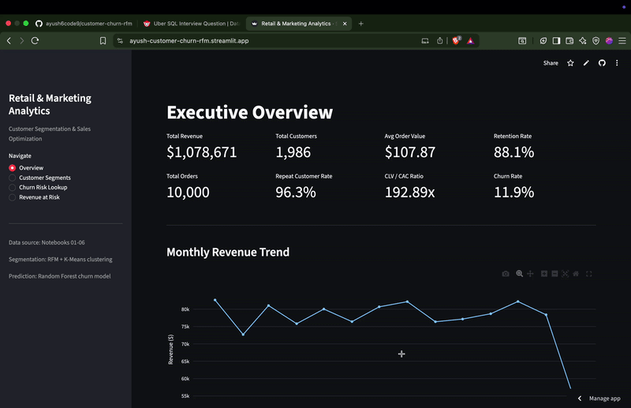

# Retail & Marketing Analytics — Customer Segmentation, Churn Prediction & Sales Optimization

**End-to-end analytics and machine learning pipeline** that turns 10,000 raw retail transactions into customer segments, a churn prediction model, and a live interactive dashboard — built to demonstrate the full workflow of a Data Analyst, Data Scientist, and ML Engineer in a single project.

🔗 **[Live Dashboard →](https://ayush-customer-churn-rfm.streamlit.app/)**

---

## Table of Contents
- [Business Problem](#business-problem)
- [Approach](#approach)
- [Project Architecture](#project-architecture)
- [Live Dashboard](#live-dashboard)
- [Notebooks Breakdown](#notebooks-breakdown)
- [Key Results](#key-results)
- [Tech Stack](#tech-stack)
- [Testing](#testing)
- [Repository Structure](#repository-structure)
- [What This Project Demonstrates](#what-this-project-demonstrates)

- [Author](#author)

---

## Business Problem

A retail business selling across 4 product categories and 4 regions has ~2,000 customers generating over **$1M in revenue**, but has no systematic way to answer the questions that actually drive marketing and revenue decisions:

- **Who are our most valuable customers, and who is at risk of leaving?**
- **Which customers will churn next, before it's too late to act?**
- **How much revenue is actually at risk right now, and who should retention efforts target first?**
- **What are the KPIs leadership should track every month, and why?**

This project answers all four — moving from raw transaction data to a **deployed, interactive tool** a marketing or retention team could genuinely use.

---

## Approach

The project is built as a **6-stage pipeline**, each stage handing clean, validated output to the next — mirroring how a real analytics/ML team would structure a production project rather than one monolithic notebook.

```
Raw Data → Clean & Engineer → Explore → Segment & Model Behavior → Report KPIs → Predict Churn → Deploy
```

1. **Acquire & set up** the raw dataset and project structure
2. **Clean & engineer features** (missing values, outliers, 20+ engineered features)
3. **Explore** the data to surface initial business insights
4. **Segment customers** using RFM analysis + K-Means clustering, and calculate Customer Lifetime Value
5. **Design a KPI framework** and generate an executive summary report
6. **Predict churn** with a tuned, explainable machine learning model
7. **Deploy** everything as a live, interactive Streamlit dashboard

Every stage is backed by an **automated test suite** (`pytest`) that validates data integrity and model quality — catching silent bugs (like a degenerate feature or a model that never beats baseline) before they propagate downstream.

---

## Project Architecture

```
┌─────────────────┐     ┌──────────────────┐     ┌───────────────────┐
│   Raw Data       │ →  │  Cleaned +        │ →  │  RFM Segments +    │
│  (10,000 orders) │     │  Engineered Data  │     │  K-Means Clusters  │
└─────────────────┘     └──────────────────┘     └───────────────────┘
                                                            │
                                                            ▼
┌─────────────────┐     ┌──────────────────┐     ┌───────────────────┐
│  Live Streamlit  │ ←  │  Churn Model      │ ←  │  KPI Framework +   │
│  Dashboard        │     │  (RF/XGB + SHAP)  │     │  Executive Summary │
└─────────────────┘     └──────────────────┘     └───────────────────┘
```

- **Data layer:** `data/raw/` → `data/processed/` (versioned CSV outputs at each pipeline stage)
- **Analysis layer:** 6 Jupyter notebooks, each independently re-runnable
- **Validation layer:** `tests/` — 16 automated checks on data quality, segmentation integrity, and model performance
- **Presentation layer:** `app.py` — a Streamlit app reading directly from `data/processed/` and `outputs/models/`, deployed live

---

## Live Dashboard

**[https://ayush-customer-churn-rfm.streamlit.app/](https://ayush-customer-churn-rfm.streamlit.app/)**

A 4-page interactive app built on top of the notebook outputs — not a static report, but a live tool:

| Page | What it shows |
|---|---|
| **Overview** | Live KPI cards (revenue, customers, AOV, retention), monthly revenue trend, revenue by category/region |
| **Customer Segments** | Filterable RFM segment sizes and revenue share, interactive 3D Recency-Frequency-Monetary scatter plot |
| **Churn Risk Lookup** | Select any customer → get a **live churn probability** from the trained Random Forest model, risk tier, and full profile |
| **Revenue at Risk** | Adjustable risk-threshold slider, churn probability distribution, downloadable high-risk customer list |

**Demo**


---

## Notebooks Breakdown

| Notebook | Purpose | Key Techniques |
|---|---|---|
| **01 — Data Acquisition & Setup** | Project structure setup, dataset loading with fallback generation, initial data quality inspection | Missing value audit, dtype profiling, data quality report |
| **02 — Data Cleaning & Preprocessing** | Missing value imputation, duplicate removal, outlier treatment, feature engineering | IQR-based Winsorization, 20+ engineered features (time, revenue, delivery, customer, product, seasonal) |
| **03 — Exploratory Data Analysis** | Univariate/bivariate/time-series analysis, customer & product behavior patterns | Correlation analysis, Pareto (80/20) analysis, weekend/seasonal trend detection |
| **04 — Customer Segmentation & Advanced Analytics** | RFM scoring, K-Means clustering, cohort retention, Customer Lifetime Value | Elbow/Silhouette/Davies-Bouldin cluster validation, PCA visualization, cohort retention heatmap |
| **05 — KPI Design & Dashboard Preparation** | Full KPI framework across revenue, customer, product, and marketing metrics; executive summary generation | Monthly/category/regional KPI aggregation, stakeholder-ready reporting |
| **06 — Customer Churn Prediction** | Supervised churn prediction with explicit leakage prevention | Baseline → Logistic Regression → tuned Random Forest (`RandomizedSearchCV`) → XGBoost, automatic best-model selection, **SHAP explainability**, model persistence |

Each notebook is self-contained with markdown explanations before every code section, and saves its outputs to `data/processed/` or `outputs/` for the next notebook to consume.

---

## Key Results

**Business metrics** (from the analyzed dataset):

| Metric | Value |
|---|---|
| Total Revenue | $1,078,670.98 |
| Total Customers | 1,986 |
| Customer Retention Rate | 88.1% |
| Repeat Customer Rate | 96.3% |
| Overall Churn Rate | 11.9% |
| Customer Segments Identified | VIP Customers (922, 46.4%) · At Risk (1,064, 53.6%) |

**Churn model performance** (selected model: tuned Random Forest):

| Metric | Score |
|---|---|
| Test ROC-AUC | **0.951** |
| Recall (Churned class) | 93.2% |
| Precision (Churned class) | 52.9% |
| F1 Score (Churned class) | 0.675 |
| Baseline accuracy (majority class) | 88.1% *(shown for contrast  accuracy alone is misleading on imbalanced data)* |

Model comparison — the Random Forest was selected automatically based on test ROC-AUC, beating both Logistic Regression (0.907) and XGBoost (0.946):

| Model | Test ROC-AUC | CV ROC-AUC (mean) |
|---|---|---|
| Logistic Regression | 0.9068 | 0.9042 |
| **Random Forest (tuned)**  | **0.9510** | 0.9359 |
| XGBoost | 0.9461 | 0.9376 |

**Business translation:** the top 20% highest-risk customers (398 people) represent **$127,162 in historical revenue (11.8% of total)** — this is the number retention efforts should be prioritized against, generated automatically by the model rather than a manual estimate.

---

## Tech Stack

**Languages & Environment**
`Python 3.11` · `Jupyter Notebook`

**Data Analysis & Engineering**
`pandas` · `numpy` · `scipy`

**Visualization**
`matplotlib` · `seaborn` · `plotly`

**Machine Learning**
`scikit-learn` (Logistic Regression, Random Forest, K-Means, PCA, `RandomizedSearchCV`) · `XGBoost` · `SHAP` (model explainability)

**Testing & Quality**
`pytest` — 16 automated tests across data quality, segmentation integrity, and model validation

**Deployment**
`Streamlit` — live interactive dashboard, deployed on Streamlit Community Cloud

**Model Persistence**
`joblib`

---

## Testing

This project includes an automated test suite  something most portfolio projects skip, but which directly caught and prevented real bugs during development (e.g., a degenerate feature that silently collapsed all customer segments into one).

```bash
pytest tests/ -v
```

**16 tests across 3 files:**
- `test_data_quality.py` — no nulls/duplicates in critical columns, valid value ranges, date consistency
- `test_rfm_clv.py` — Monetary/CLV values are non-degenerate, segments aren't collapsed, RFM/CLV customer IDs are consistent
- `test_churn_model.py` — no data leakage in model features, churn probabilities fall in valid range, **model must beat a 0.70 minimum ROC-AUC threshold** or the test suite fails

---

## Repository Structure

```
retail-marketing-analytics/
├── app.py                      # Live Streamlit dashboard
├── requirements.txt            # Slim, deployment only dependencies
├── requirements-dev.txt        # Full dependencies for local notebook development
├── pytest.ini
│
├── notebooks/
│   ├── 01_Data Acquisition and Setup.ipynb
│   ├── 02_Data Cleaning and Preprocessing.ipynb
│   ├── 03_Exploratory Data Analysis (EDA).ipynb
│   ├── 04_Customer Segmentation and Advanced Analytics.ipynb
│   ├── 05_KPI Design and Dashboard Preparation.ipynb
│   └── 06_Customer_Churn_Prediction.ipynb
│
├── data/
│   ├── raw/                    # Original dataset
│   └── processed/              # Cleaned data, RFM/CLV/segment tables, churn predictions
│
├── outputs/
│   ├── figures/                # 37+ saved charts and visualizations
│   ├── models/                 # Trained churn model, scaler, feature schema
│   └── reports/                # KPI summaries, executive summary, churn business report
│
├── README.md                   # Complete Project Overview
└── tests/                      # pytest suite (data quality, RFM/CLV, model validation)
```

---

---

## What This Project Demonstrates

RFM segmentation, cohort retention analysis, a full KPI framework across 6 metric categories, monthly/category/regional reporting, and a stakeholder-ready executive summary  the core deliverables of a retail/marketing analytics role.

Statistically grounded clustering (K-Means validated with 3 separate metrics: Elbow, Silhouette, Davies-Bouldin), Customer Lifetime Value modeling, cohort analysis, and a fully cross-validated supervised learning pipeline with proper leakage prevention.

Model comparison across 3 algorithms with automated best model selection, hyperparameter tuning via `RandomizedSearchCV`, SHAP based explainability at both global and individual prediction levels, model persistence, an automated test suite guarding against regressions, and a live production deployment.

---

---

## Author

**Ayush Kumar Singh**
IIIT Bhagalpur

📎 [Live Dashboard](https://ayush-customer-churn-rfm.streamlit.app/) · GitHub Repository

---

*If you found this project useful or interesting, a ⭐ on the repo is appreciated.*